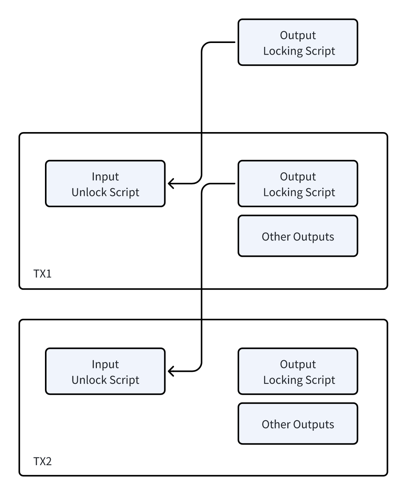
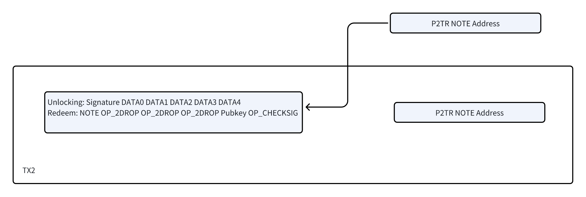
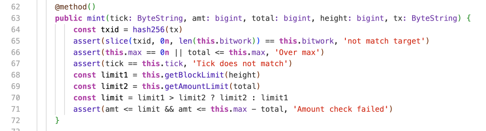

# NOTE: The Bitcoin Protocol with Smart Contract Capabilities

**The NOTE protocol marks a significant advancement in the history of Bitcoin.**

The NOTE protocol is a digital asset issuance protocol based on Bitcoin's UTXO model, distinct from many recently emerged protocols, as NOTE is genuinely rooted in Bitcoin's UTXO model. It utilizes a smart contract language compatible with Typescript, whose compilation results in Bitcoin native opcodes, enabling a powerful feature set that includes Oracles and zero-knowledge proofs.

Unlike protocols such as Ordinals and Atomicals, NOTE also uses an indexer to tally user assets, but it is entirely based on cryptography, secured by Bitcoin miners to ensure asset ownership, thus avoiding misoperations due to indexer tagging. Moreover, NOTE's transaction costs are extremely low, eliminating the need to send two transactions as with Ordinals and Atomicals. More importantly, the NOTE protocol supports smart contracts, for instance, enabling Bitwork mining and a diminishing mining quantity over time. It employs actual Token values, not based on prime protocols numbered by Satoshi nor dependent on UTXO balance coloring schemes.

Compared to many "inter-chain bridging protocols," NOTE issues native Bitcoin assets, avoiding operations that involve using BTC as collateral to issue and trade assets on other chains.

| Protocol | Ordinals/BRC20 | Atomicals/ARC20 | EVM/Zk Layer2 | NOTE/N20 |
|-------|-------|-------|-------|-------|
| UTXO | YES | YES | NO | YES| 
| Bitcoin Assets | YES | YES | NO | YES | 
| Smart Contract | NO | NO | YES(EVM) | YES(Bitcoin OP Codes) | 
| Indexer | YES | YES | NO | YES | 
| Index Logic | Satoshi Ordinals | Colored Satoshi | - | Cryptography | 
| Cross Chain Transfer | NO | NO | YES with bridge | YES | 
| Fee(Gas) | High | High | Medium-Low | Low | 
| Fund | NO | Unkowon | YES or Unkowon | NO | 

The NOTE protocol supports cross-chain functionality, allowing native assets on Bitcoin to be sent to other UTXO chains, as well as receiving assets from these chains. All of this is based on cryptography and the consensus of the Bitcoin blockchain.

This protocol is entirely the result of open-source contributions from Bitcoin development luminaries, with no institutional investment involved.

Now, let's delve into a detailed **technical interpretation**:

The last bull market was ignited by a large number of institutional investment projects and ultimately collapsed with the downfall of institutions like FTX. Starting from the bear market bottom in 2023, the market has returned to the grassroots and developer enthusiasts' home ground. Inscriptions led the market trend without any investment, bringing the advantages of the UTXO model back into the public eye. As the anchor of digital currency, Bitcoin needs usable and practical technological solutions to achieve asset appreciation and practical applications.

Compared to the EVM, Bitcoin's UTXO model has significant efficiency and concurrency advantages. However, issuing native assets on Bitcoin's UTXO model involves several challenging issues, mainly how assets are identified. Another issue is how assets are preserved in closely linked transactions.

A UTXO-style transaction is illustrated as follows:

The NOTE protocol adopts an innovative approach to managing Bitcoin transactions and assets, significantly different from other protocol solutions. In traditional Bitcoin transactions, the input part of a transaction unlocks a previous transaction's output (i.e., the old UTXO) and generates new transaction outputs (i.e., new UTXOs). In other protocol solutions, assets are tied to newly generated UTXOs, causing users' assets to be scattered across different UTXOs. This method requires indexers and wallets to maintain a comprehensive list of UTXOs to ensure the accuracy of asset binding relationships. It also necessitates careful management of UTXOs with asset tags to avoid spending mistakes, and the entire UTXO must be spent at once.

In contrast, the NOTE protocol employs a method that treats transaction outputs as user accounts, where a user's account is represented by the transaction output script hash, as illustrated by the TX1 transaction output in the example. This account is entirely private, and the types and quantities of assets tied to it are derived from the unlocking inputs of TX1. When these assets are spent in TX2, after being unlocked and confirmed by Bitcoin miners, new transaction outputs are generated. During this process, the indexer of the NOTE protocol only needs to record the transaction details disclosed at the time of unlocking and can provide a Merkle proof after block confirmation to verify the transaction's validity.

This design not only simplifies asset tracking and management, reducing the issue of asset fragmentation, but also enhances transaction privacy. By using transaction outputs as accounts and relying on the verification by Bitcoin network miners and the blockchain consensus mechanism, the NOTE protocol offers a more secure, efficient, and privacy-preserving method for managing digital assets.

A typical Taproot P2TR format transaction is illustrated as follows:

The technical strategy adopted by the NOTE protocol significantly differs from the Ordinals and Atomicals protocols. Ordinals and Atomicals utilize the redemption script of P2TR (Taproot) to create an inaccessible data area by adding OP_FALSE OP_IF opcodes, embedding additional data. In contrast, the NOTE protocol allows direct manipulation of unlocking data through opcodes, enhancing data usability. In the NOTE protocol, example scripts can directly pop data from the stack, while more complex scripts can perform on-chain checks such as hashlock.

Moreover, the NOTE protocol is not limited to using P2TR; it can also be implemented through P2SH (Pay to Script Hash), P2WSH (Pay to Witness Script Hash), and non-standard scripts, increasing the protocol's flexibility and the capability for cross-chain asset transactions. A key innovation of the NOTE protocol is its use of msgpack encoding instead of json encoding for data, which is more compact and helps reduce the data volume per transaction, thereby lowering transaction costs for users.

In the NOTE protocol, addresses constructed by specific redemption scripts act as user accounts. These account addresses can only be confirmed by miners when correctly unlocked. The asset transaction data contained in the unlocking script is recognized by the indexer upon unlocking and processed by off-chain smart contracts. Only asset transactions verified by off-chain contracts are recorded by the indexer, effectively preventing Bitcoin wallets from mistakenly spending NOTE's UTXO and allowing the recovery of small amounts of Bitcoin (e.g., 546 Satoshi) in UTXOs.

The design of the NOTE protocol considers multiple upgrades to privacy and transaction space optimization in the Bitcoin network since 2017. At the same time, it draws on the large block strategy represented by BSV (Bitcoin SV), delving into the potential of Bitcoin scripting. The smart contract solution of the NOTE protocol is based on the Bitcoin smart contract language developed by the sCrypt team, which supports off-chain contract verification. Since the Bitcoin script language is Turing complete and ensures execution within a given script length, indexers are not trapped in infinite loops due to poorly designed smart contracts, ensuring system stability and efficiency.

A demo smart contract project has been released on GitHub.

https://github.com/NoteProtocol/scryptdemo 

It demonstrates the capability of the NOTE protocol to implement complex logic on the Bitcoin network through simulating Bitcoin mining's halving mechanism and Atomicals' Bitwork difficulty mining with a PoW contract. By generating a 1KB Bitcoin script, the contract allows indexers to call and verify whether transactions comply with the protocol, showcasing the feasibility and flexibility of smart contracts on the Bitcoin network.

The use of Rabin signature algorithm Oracles and complex contracts based on zero-knowledge proofs provides a higher level of security and privacy protection. These technologies play a crucial role in the implementation of smart contracts, especially when verifying specific conditions or executing particular logic.

Leveraging these smart contracts, asset issuance on Bitcoin can be used to realize real-world application scenarios, such as bounty scenarios for solving problems with AI. In such scenarios, anyone who can submit a verifiable computational result can receive a reward. This not only demonstrates the practicality of Bitcoin smart contracts but also shows how they can facilitate the realization of complex applications beyond traditional financial transactions and asset management.

The application prospects and implementation mechanisms of smart contracts on the Bitcoin network reflect an important direction in the development of cryptocurrency technology: combining blockchain's decentralization and immutability with complex business logic and application scenarios to explore new possibilities. For those interested in delving deeper or participating in development, following and learning from these smart contract projects and their implementations on GitHub is undoubtedly a valuable resource.

The latest developments and announcements of the NOTE protocol showcase its depth and breadth in the blockchain technology field. The issuance of N20 Token assets is just one of the many functions of the NOTE protocol. It also includes DID (Decentralized Identity), encrypted data, and ownership identification, and with the formulation and verification process of N721 NFTs and Alias (Bitcoin alias system), the capabilities and application scope of the NOTE protocol are expected to expand further.

Currently, to allow users to experience the minting and transferring of N20 Tokens, a command-line wallet has been released on GitHub, and an open-source indexer is also planned to be released. The openness of these tools and resources aims to encourage community member participation and practical experience with the NOTE protocol's functions, thereby accelerating the protocol's testing, improvement, and application development.

The open-source contributors behind the NOTE protocol emphasize that all content is for technical discussion only, and any asset issuance and speculation are unrelated to the contributors. This stance encourages a community environment centered on technology and innovation, rather than speculation and investment.

As the NOTE protocol continues to be developed and refined, it is foreseeable that more real applications based on this protocol will emerge. These applications will leverage the unique functions and advantages of the NOTE protocol to create new value and possibilities in Bitcoin and broader blockchain fields. The ongoing contributions and collaborative spirit of the open-source community are indispensable forces driving this process.

**Summary**

The NOTE protocol represents a significant advancement in the expansion of the Bitcoin network towards smart contract functionality. By introducing smart contracts to Bitcoin, the most original and widely used cryptocurrency platform, the NOTE protocol not only enhances Bitcoin's functionality but also offers unprecedented possibilities for innovation to developers and users. Here are several key features of the NOTE protocol:

Smart Contract Support: The NOTE protocol extends the application range of Bitcoin through smart contracts, allowing for the creation and execution of more complex logic and transaction types on the Bitcoin network. This includes, but is not limited to, asset issuance, decentralized finance (DeFi) applications, and other scenarios requiring conditional execution.

UTXO-based Model: Unlike account-based smart contract platforms, the NOTE protocol is built on Bitcoin's UTXO model, leveraging Bitcoin's security and efficiency.

Cross-chain Functionality: The NOTE protocol supports cross-chain transactions, enabling digital assets to move between different UTXO chains, further enhancing its flexibility and application scope.

Real-world Applications: The NOTE protocol supports advanced cryptographic technologies, such as zero-knowledge proofs and Rabin signature algorithms, which can be applied in more complex real-world application scenarios.

Low Cost and High Efficiency: By optimizing data storage and using msgpack encoding, the NOTE protocol aims to reduce transaction costs and improve network efficiency.

Open Source and Community-driven: The NOTE protocol emphasizes the spirit of open source and community contribution, promoting the transparency and trustworthiness of the technology while also encouraging broader development and application innovation.

As the NOTE protocol continues to develop and its applications deepen, we can expect to see more innovative applications and services emerging in the Bitcoin ecosystem, all of which will provide users with richer functionality and a better experience while maintaining Bitcoin's core values.

Website: https://noteprotocol.org

X: https://twitter.com/NoteProtocol

GitHub: https://github.com/NoteProtocol
