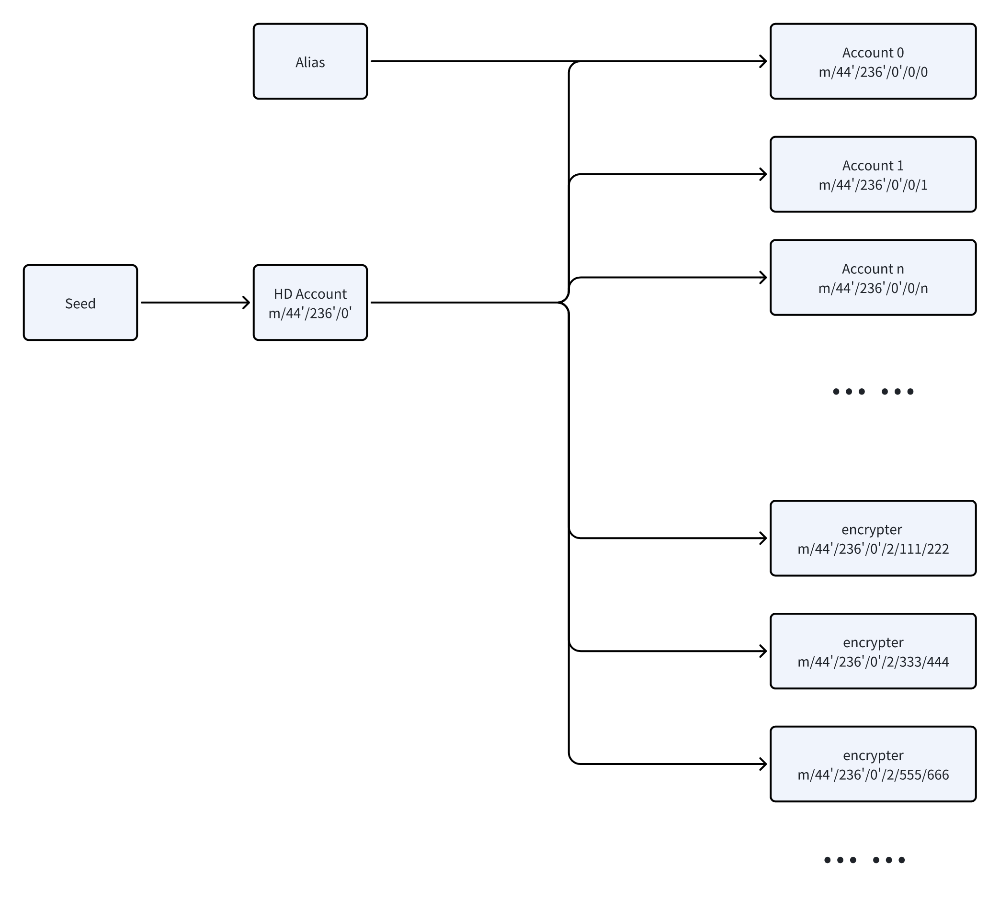

### 2.2 Decentralized IDs
Decentralized IDs are generated on users' devices, like smartphones or PCs, using the BIP32 protocol to derive both the account's public and private keys, and separate private keys for encrypting data. These private keys act as a unique decentralized identity, with the public keys serving to recognize users. These identities are essential across various functions, including validating ownership, signing transactions, and managing data creation and sharing.





#### 2.2.1 Generating Account Keys
The method to derive account keys follows this path:


```m/purpose'/coin_type'/account'/target/index```

For instance, within the NOTE.SV application, the setup is as follows:

```
purpose = 44
coin_type=236
account=0
target=0
index=0
```

The full path for derivation is:

```
  const extPath = m/44'/236'/0'/0/0
```

By sequentially incrementing the index, it's possible to create multiple accounts.


#### #### 2.2.2 Generating Data Encryption Keys

The path for deriving data encryption keys is outlined as:


```
m/purpose'/coin_type'/account'/target/quotient/remainder
```

For this process, NOTE.SV adopts the following variables:

```
purpose = 44
coin_type=236
account=0
target=2
```

The derivation path is produced through these steps:

1. Randomly generate a 64-bit integer, n.
2. Modulate this number following IEEE754 standards, n % (2^53-17) + 16, to obtain a derivation index.
3. Divide the derivation index by a Hardened value to get both a quotient and a remainder, as shown below:


```
  const Hardened = 0x80000000 
  const quotient = Math.floor(index / Hardened)
  const remainder = index % Hardened
```

The comprehensive derivation path becomes:

```
  const extPath = m/44'/236'/0'/2/${quotient}/${remainder}
```

In NOTE.SV, indices 0 to 15 are specially allocated. For instance,


```
0: Designated for data sharing
1: Represents unencrypted plaintext
```
