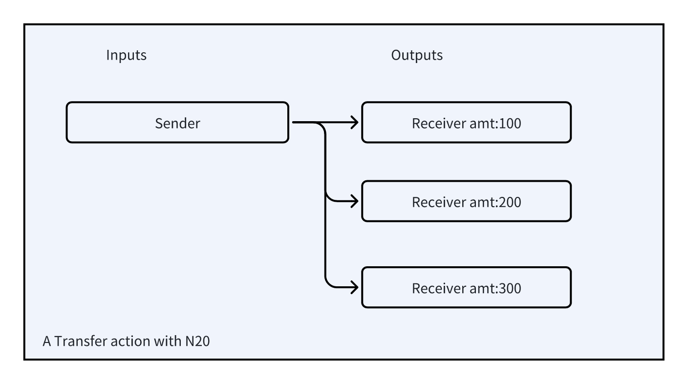

## 4.3 Transferring

The transferring process is designed to facilitate transactions to multiple parties at once.


```json
{ 
  "p": "n20",
  "op": "transfer",
  "tick": "note",
  "amt": [100,200,300]
  ... ...
}
```

| Key | Required? | Description |
| :--- | :--- | --- |
| p | Yes | Protocol: Aids in the identification and processing of N20 actions by other systems. Not sensitive to capitalization. |
| op | yes | Operation: Type of active (deploy, mint, transfer, burn)  |
| tick | Yes | Ticker: An identifier consisting of letters, with a maximum of 16 bytes. Not sensitive to capitalization. Cannot be deployed if a ticker with the identical name exists. |
| amt | Yes | Amounts to Transfer: Specifies the numeric list of N20 amounts to be transferred. |

The account launching the action acts as either the data or transaction signer. The recipients impacted by this action are listed in the transaction's outputs.



The assignment of Sender and Receiver roles is managed through Bitcoin transactions.
