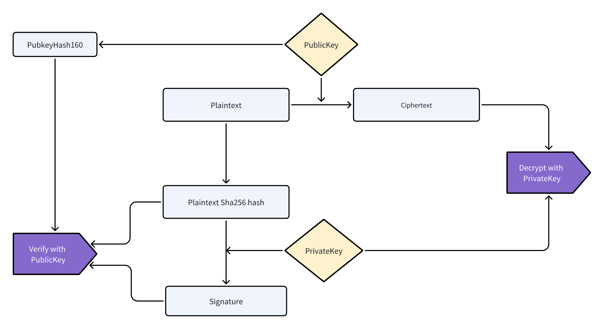

## 3.1 Data Format and Sequence

The format and sequence of data on the blockchain are established as follows.

```
Public Key HASH, Plain Data Hash, Data, Signature, Note Annotation
```


The breakdown is as follows:

1. data0: Public Key HASH, representing the HASH160 of the account public key of the owner.
2. data1: Plain HASH
   - For encrypted messages, this is the SHA256 hash of the plaintext.
   - For public data, this is 0x00.
3. data2: Either plaintext or ciphertext, with the data being either encrypted or publicly accessible. Original data is encoded using the Msgpack protocol, ensuring keys are sorted (sortKeys=true).
4. data3: Signature, which is generated by the owner's account private key signing the plain HASH. The signature can be authenticated using the owner's account public key. The signing method adheres to the Bitcoin Message standard. If a transaction's public key signature is provided, this field is 0x00; otherwise, a signature is mandatory.
5. data4: Specifies the data's format
   1. An 8-byte integer, 0x00, denotes encryption with the owner's account public key.
   2. A 1-byte integer, 0x01, signifies the data is unencrypted.
   3. An 8-byte integer, within the range of 16 to 2^53 - 16, indicates encryption with the data encryption public key.
6. NOTE: A protocol identifier, always in uppercase.

### 3.1.1 Data Relationship Diagram



