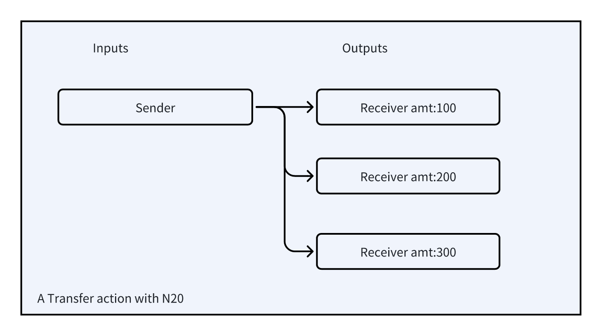

## 4.5 Transfer

Transfers support sending tokens to multiple recipients simultaneously. Below is the definition for a transfer operation:

```json
{
  "p": "n20",
  "op": "transfer",
  "tick": "note",
  "amt": 100 或者 [100,200,300]
  ... ...
}
```

| Key | Required? | Description |
| :--- | :--- | :--- |
| p | Yes | Protocol name, n20, lowercase |
| op | Yes | Operation name, transfer, lowercase |
| tick | Yes | Token name, up to 16 bytes, case-insensitive |
| amt | Yes | Bigint or Bigint[], a large integer or array of large integers, the amount to be transferred, must be greater than or equal to 0 |
| ... | No | Other variables needed during the transfer operation |

The first input of the transaction is the account initiating the operation, and the recipients are included in the transaction outputs. If the account has more tokens than the amount transferred, the excess tokens will be assigned to the next transaction output's token address for change. Otherwise, it is not necessary to specify a change token address.

Example code:

```typescript
{
  p:"n20",
  op:"transfer",
  tick:"NOTE",
  amt:[100,200]
}

```



The first input of the transaction unlocks the sender's UTXO, which is bound with 600 tokens. The recipients are the token addresses of the first two transaction outputs, and the third address is for change.
