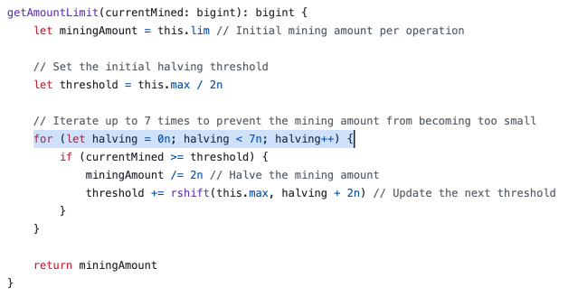

图灵完备和停机问题

我们说原生的比特币脚本语言是图灵完备的。会被很多人喷。

图灵完备（Turing Complete）语言是指一种可以实现任何图灵机能够计算的计算的编程语言。这个概念来源于阿兰·图灵（Alan Turing），他提出了图灵机模型，这是一种抽象的机器，通过读写无限长纸带上的符号来执行计算。

如果一个编程语言是图灵完备的，意味着它能够模拟图灵机的所有计算功能。这通常意味着这种语言必须能够进行条件分支（比如if/else语句）和循环（或递归），这样才能根据数据做出决策并重复执行某些操作直到满足特定条件。

纸带无限长，一个死循环的程序可以一直执行下去。这是否合理？能实现死循环的程序就是图灵完备的，这种说法是否合理？

实际上，简单的死循环可以通过非常基础的指令集实现，但如果没有足够的控制结构（如条件分支）和数据处理能力，这样的系统还是不能称为图灵完备的。图灵完备需要的是能够表达任意复杂的算法逻辑，包括但不限于循环结构。同时，死循环带来另外一个问题：停机问题。

停机问题（ Halting Problem）是计算理论中一个非常著名的问题，同样由阿兰·图灵在上世纪30年代提出。这个问题探讨是否存在一个算法，该算法能够判定任何给定的程序和其输入是否最终停止执行（即程序会在有限的步骤后结束，而不是无限循环下去）。

图灵证明了停机问题是不可解的。图灵完备系统能够表达和执行所有可能的程序包括那些永不停机的程序。而停机问题的不可解性直接源于这种系统的这种能力。简而言之，图灵完备系统的强大计算能力带来了停机问题的不确定性，因为在这样的系统中，我们无法预先知道某个程序是否能够在所有情况下停止。

比特币脚本语言被误认为不是图灵完备的，主要是因为它的操作码中没有显式的循环命令。然而，通过复杂的脚本和条件逻辑，可以间接实现循环行为，类似于汇编语言。例如，实现从1加到100的累加，可以通过连续的加法操作来实现，直到达到100。这种方法有效避免了停机问题，因为比特币的交易和区块有明确的大小限制，从而保证脚本在达到某个大小后必须停止。

因此，可以认为: 比特币脚本语言在某种程度上是图灵完备的，并且通过大小限制解决了停机问题。

在以太坊中，每个操作码消耗的“gas”起到了类似的限制作用，避免了程序无限运行的问题。如果没有其他限制的话，理论上以太坊大户可以用钱实现执行一年的程序，堵死EVM。

无论资金多少，比特币的设计确保了不可能无限增大区块大小，这是共识机制的一部分。保持系统的简洁性（KISS原则 Keep it Simple, Stupid.）是 #中本聪 设计比特币时的重要考虑因素。

在 Note协议的链下合约环境中，脚本大小仍受到严格控制，当前约有2.5K的脚本JSON存储空间，未来可能扩展到更大容量。
