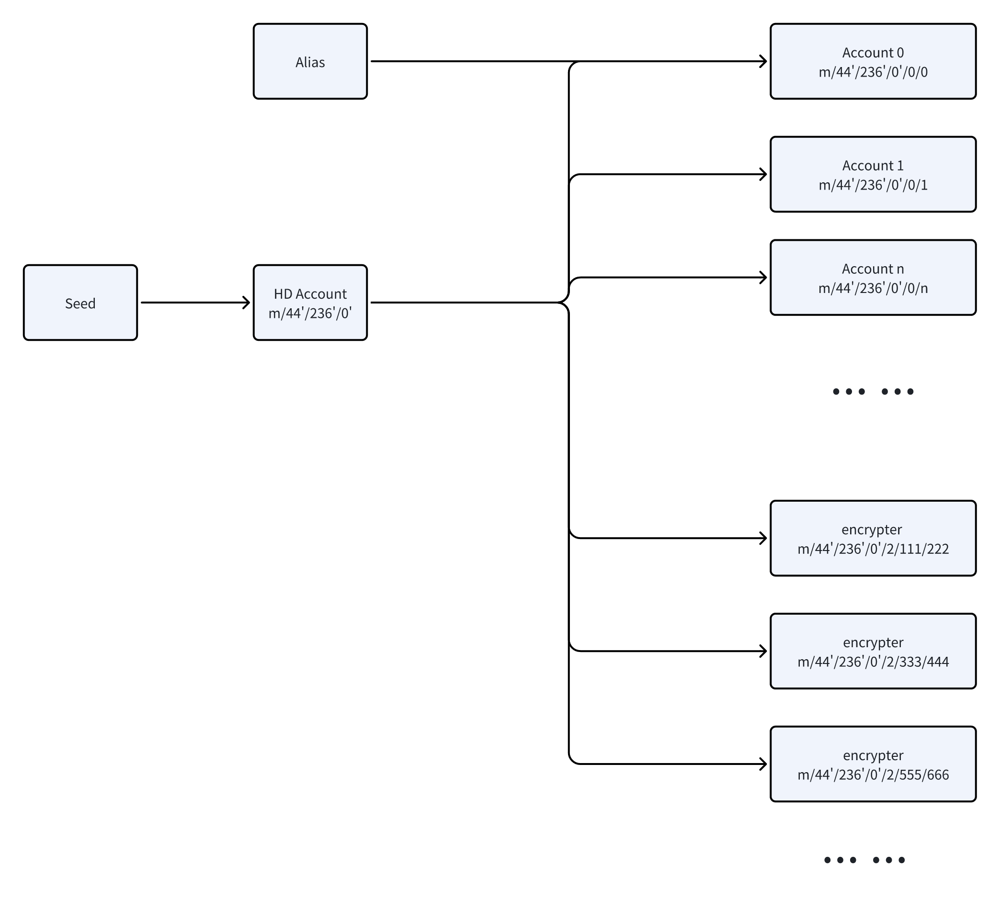

### 2.2 去中心化ID

在用户的终端设备（如手机或电脑）上，基于BIP32协议派生账户公私钥和用于数据加密的私钥。这些私钥作为去中心化身份标识，使用公开的账户公钥来标识用户。在所有权确认、签名、数据创建和分享等所有场景中均使用此身份。



#### 2.2.1 账号密钥

账号密钥基于以下路径派生：

```m/purpose'/coin_type'/account'/target/index```

比如在NOTE.SV软件中使用了下面的变量

```typescript
purpose = 44
coin_type=236
account=0
target=0
index=0
```

完整的派生路径为：

```typescript
  const extPath = m/44'/236'/0'/0/0
```

顺序增加index可以创建多账号。

#### 2.2.2 数据加密密钥的派生

当数据需要加密时，加密密钥的派生路径定义如下：

```typescript
m/purpose'/coin_type'/account'/target/quotient/remainder
```

在NOTE.SV软件中，使用了以下变量：

```typescript
purpose = 44
coin_type=236
account=0
target=2
```

派生路径的生成步骤如下：

1. 随机生成一个64位整数 n。
2. 遵循IEEE754标准，对随机数取模 n % (2^53-2) + 1，生成派生索引。
3. 使用派生索引除以Hardened，获取商和余数。代码如下：

```typescript
  const Hardened = 0x80000000
  const quotient = Math.floor(index / Hardened)
  const remainder = index % Hardened
```

完整的派生路径为：

```typescript
  const extPath = m/44'/236'/0'/2/${quotient}/${remainder}
```

在NOTE.SV软件中对于0到16的index进行了保留。比如

```typescript
0: 数据分享用
1: 明文未加密
```
