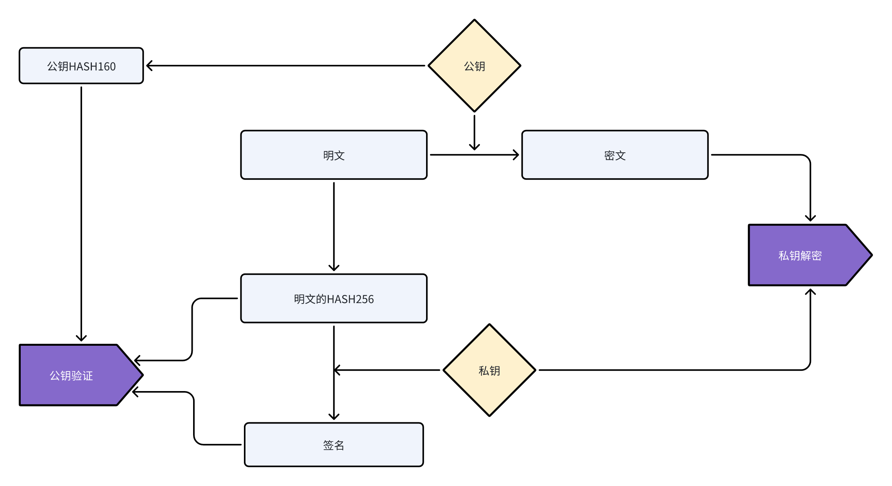

## 3.1 数据的格式和顺序

链上数据的格式和顺序作如下规定。

```typescript
公钥HASH 明文数据HASH 数据 签名 标注 NOTE
```

解释如下：

1. data0: 公钥HASH, 持有者的账号公钥的HASH160
2. data1: 明文HASH

   - 如果是加密信息，则为明文的SHA256值。
   - 如果是公开数据，则为0x00。

3. data2: 明文或密文, 数据可为加密或公开数据。原始数据使用Msgpack协议编码，需排序键值（sortKeys=true）。
4. data3: 签名, 使用持有者账号私钥对明文HASH进行的签名。签名可通过持有者账号公钥验证。签名算法采用Bitcoin Message标准。如果可以提供交易的公钥签名，此处为0x00；否则必须有签名。
5. data4: 描述数据的表现形式
   1. 8字节的整数0x00,表示数据使用了持有者的账号公钥加密
   2. 8字节的整数0x01,表示数据未加密
   3. 8字节的整数，范围：16～2^53 - 16，表示数据使用了数据加密公钥加密
6. NOTE：全大写，固定的协议标识符

### 3.1.1 数据关系图


