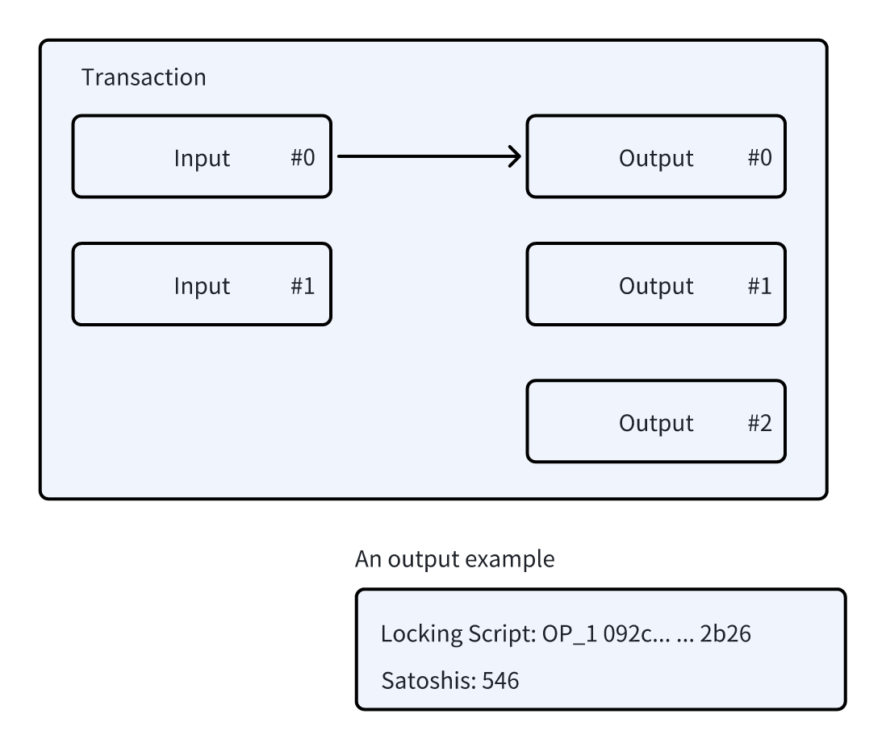
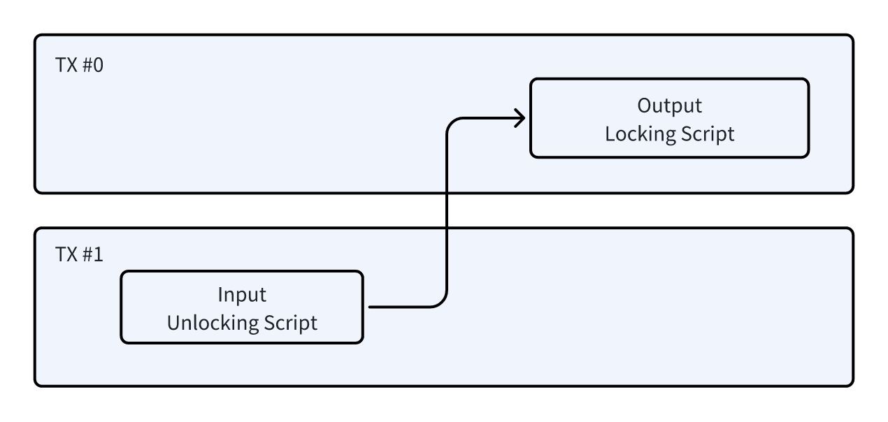
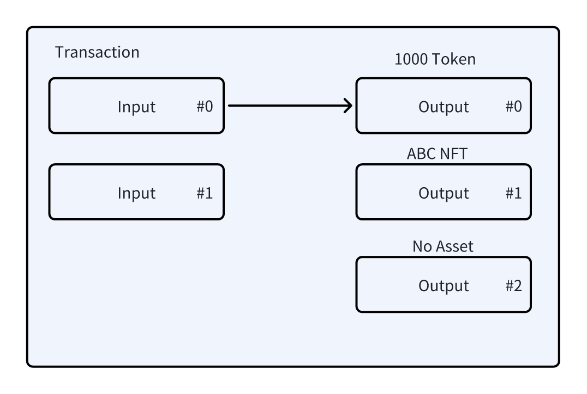
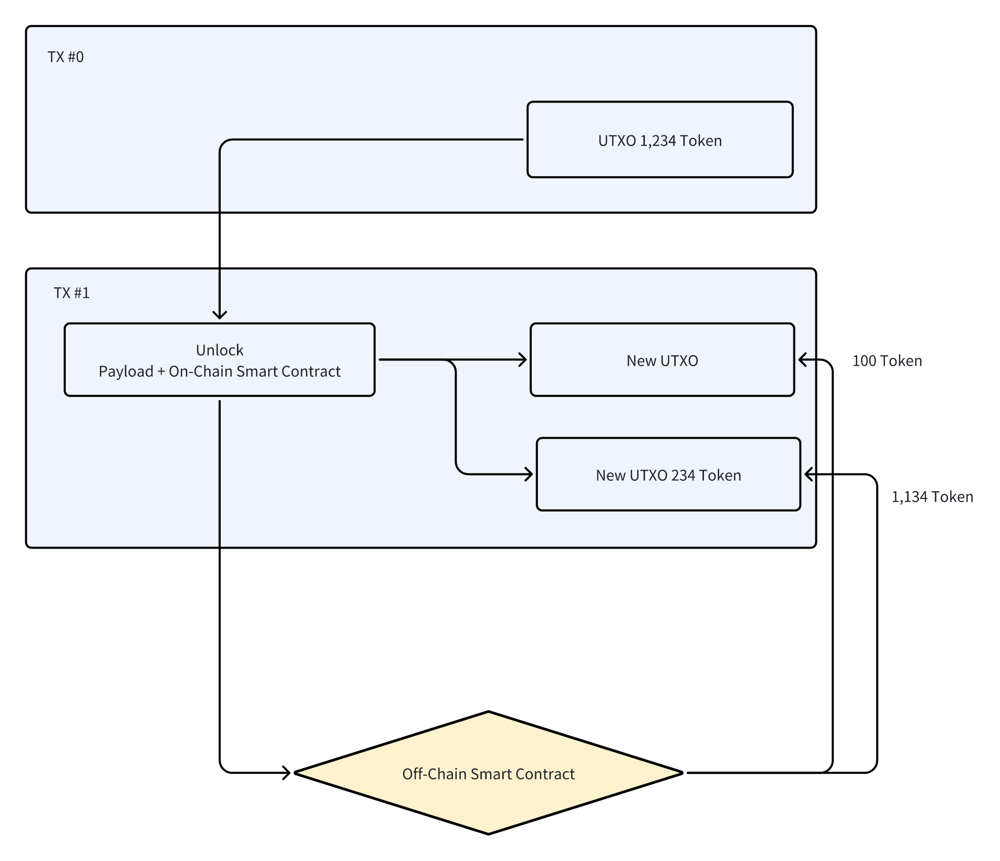

# 核心概念

## 账号

在比特币中没有账号的概念，只有地址。但其实也没有地址，只有交易输出。一个地址就是对交易输出脚本的编码。



在NOTE协议中，我们规定一个交易输出的脚本哈希值为账号。这个定义来自[Electrum协议](https://electrumx.readthedocs.io/en/latest/protocol-basics.html?highlight=script%20hash#script-hashes)

`scriptHash = sha256(script).reverse()`

总结，账号是交易输出的哈希值，长度固定为256位(32个字节)，hex字符串长度是64。地址是交易输出的编码，长度根据脚本的内容和编码规则不同。从地址可以转换为账号，反过来，从账号无法转换为地址。

## 链上合约

在NOTE协议中，数字资产账号使用特殊的脚本构造，不同于标准的P2PKH，P2WSH，P2TR地址，它在BTC中使用Taproot Script定义，一个最简单的脚本是`NOTE OP_2DROP OP_2DROP OP_2DROP Pubkey OP_CHECKSIG`

还可以是更加复杂的脚本，比如多签等等。统称这种脚本为：链上合约。我们可以使用比特币脚本操作码（OpCode）写简单的链上合约，也可以使用sCrypt语言写复杂的链上合约。

## 账号的所有权

账号的所有权归属于可以解锁的交易输出的一个或者多个私钥持有者。在常见普通的比特币交易中，一个私钥持有者，通过对UTXO的提供解锁脚本，经过矿工检查后获得所有权。同理，如果是一个多签地址，则由多个人的私钥共同签名后获取所有权。



## 数字资产

数字资产由协议定义，包括N20 Token和N721 NFT等等，数字资产绑定带交易输出上。不同于染色币，这种绑定不依赖于交易输出的satoshi数量，只跟UTXO本身有关。



## 操作

操作是指mint，transfer, burn等由协议定义，对数字资产的进行的操作。操作由msgpack编码的一组key-value定义，我们叫做Payload，放置在解锁脚本中。也就是说，如果账号的所有者需要操作数字资产，首先需要通过签名解锁账号UTXO。这个过程就是比特币的交易过程，执行了链上合约，安全性由比特币的矿工机制确保。
比如一个Payload例子

```typescript
{
  "p": "n20",
  "op": "transfer",
  "tick": "NOTE",
  "amt": 100
}
```

它表示解锁UTXO，将绑定在UTXO中的名为NOTE的数字资产转移给第一个交易输出，如果UTXO中的数字资产大于100，那么余额将转给第二个交易输出。
一旦交易被发布到区块链上，意味着链上合约执行成功所有权已经确认。NOTE协议索引器从区块链上获取此笔交易，对解锁脚本中的Payload进行解释，检查Payload是否有效，被解锁的UTXO中是否包含足够的代币数量，然后执行链下智能合约，执行tick名字背后的智能合约里的方法，方法名就是op的值，比如transfer。一旦合约执行成功，相应数量的数字资产将被绑定在交易输出上。



## TODO
